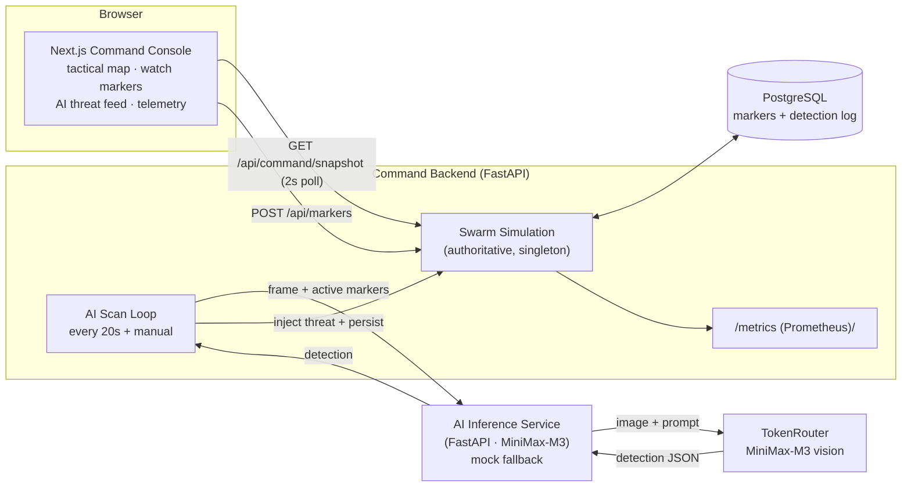

# TerraMind — Architecture

Logical view of the application and its AI-driven command loop.

## The AI loop
1. Operator defines **watch markers** (natural-language targets) — stored in Postgres.
2. The backend **scan loop** pulls active markers and sends a drone **camera frame**
   to the AI service.
3. The AI service calls **MiniMax-M3** (vision) with the frame + markers and returns a
   structured detection. If the model/key is unavailable it returns a **mock** and the
   backend marks the engine **degraded**.
4. A positive detection is **injected as a threat**, matched to its marker, persisted,
   and run through its lifecycle (`detected → confirmed → intercepting → neutralized`),
   tasking a LANCE interceptor drone.
5. Everything is exposed via `/api/command/snapshot` and Prometheus `/metrics`.

## Why this shape
- **Backend is a singleton** — it owns in-memory swarm state, so it is never autoscaled.
- **AI service is stateless** — the correct horizontal-scale target (HPA on CPU).
- **Provider-agnostic AI** — `base_url + model + key`; MiniMax-M3 today, swappable.
- **Graceful degradation** — the mock fallback is both a dev convenience and the
  disaster-recovery story.
