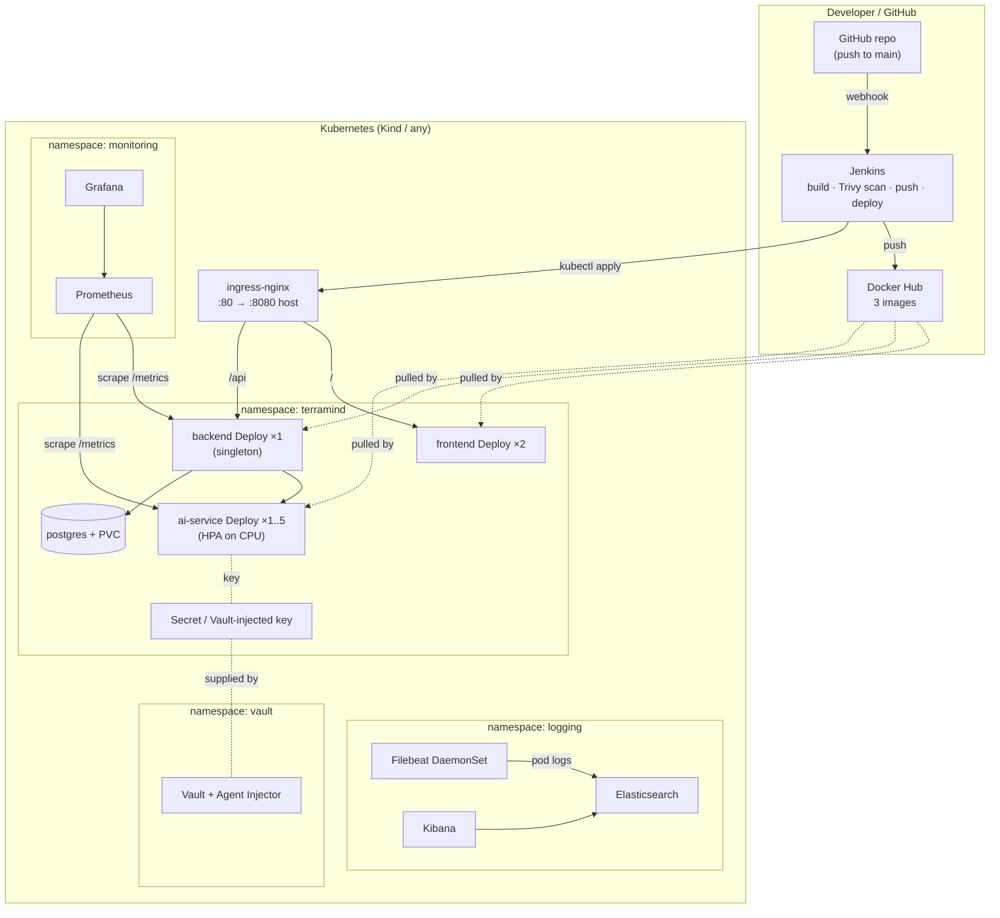

# TerraMind — Deployment Topology

Kubernetes view: how the workloads, platform services, and CI/CD fit together.

## Layers
| Layer | Owns | Tooling |
|-------|------|---------|
| **Platform** | ingress-nginx, metrics-server (HPA), monitoring/logging/vault namespaces | **Terraform** (`terraform/`) |
| **Application** | namespace `terramind`, Postgres, the 3 services, ingress, HPA | **kubectl** manifests (`kubernetes/`) |
| **CI/CD** | build → scan → push → deploy → smoke test | **Jenkins** (`jenkins/Jenkinsfile`) |
| **Observability** | metrics + dashboards | Prometheus + Grafana (`monitoring/`) |
| **Logging** | centralized container logs | ELK + Filebeat (`logging/`) |
| **Secrets** | the MiniMax-M3 key | Vault injection (`vault/`) |

## Access (local Kind)
- Console → `http://localhost:8080/`
- Backend API → `http://localhost:8080/api/command/snapshot`
- Grafana → `kubectl -n monitoring port-forward svc/kps-grafana 3001:80`
- Kibana → `kubectl -n logging port-forward svc/kibana-kibana 5601:5601`
